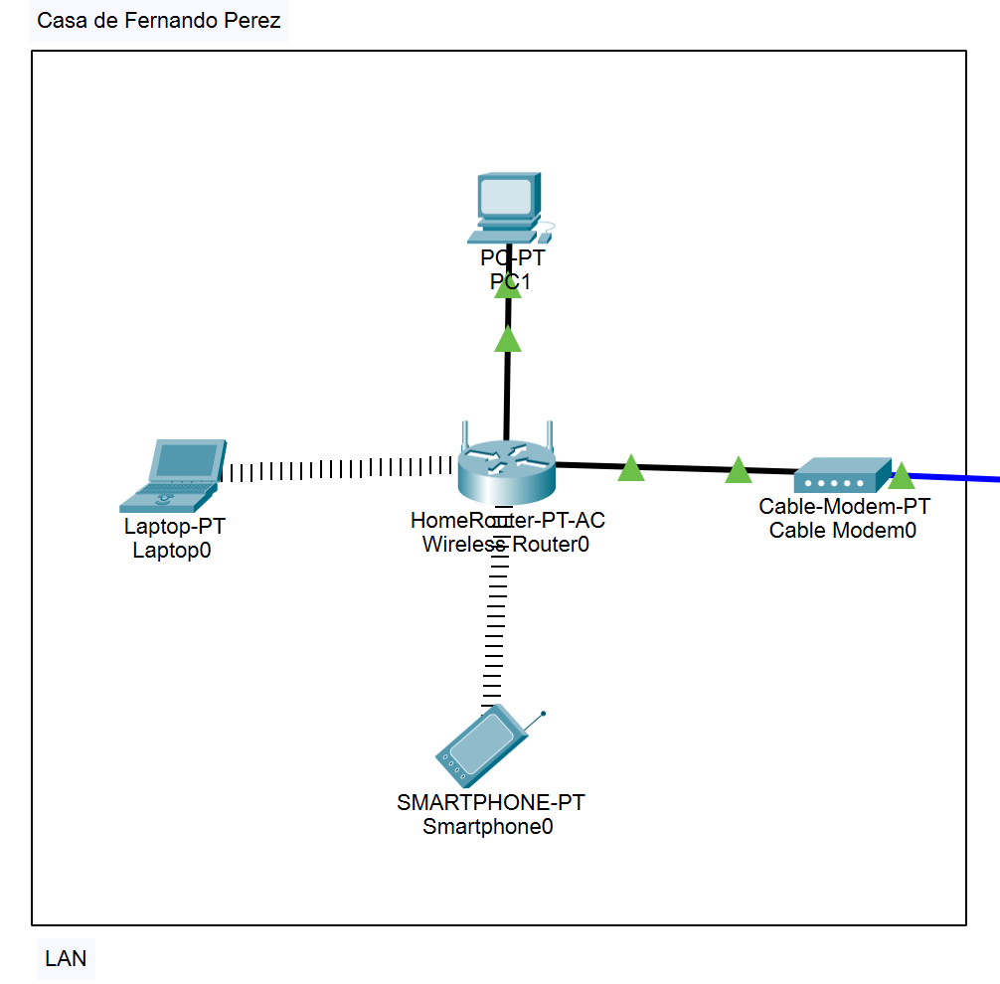

# DocumentacionLab1
## 1. Introducción
En este laboratorio ofreceremos una solución al problema de Fernando Pérez y su familia para la visualización de la plataforma disneyplus.com en sus dispositivos personales. Se creó una red simple utilizando: Un servidor, una nube de internet, un módem, un router, y los dispositivos de la casa, como laptops, PC, y celulares. Para esto, configuramos una red local, conectamos todos los dispositivos entre sí para la comunicación con la nube de internet, y configuramos la ruta del servidor para poder llegar a la página de disneyplus.com.
## 2. Topologia de red
La topología utilizada en esta práctica es una topología en estrella. En este tipo de topología, todos los dispositivos de la red están conectados a un nodo central, que en este caso es el router

### Tipos de disposiivos:-
- *Router (WRT300N):* Es un ro-uter inalámbrico que actúa como el núcleo de la red local (LAN). Permite la conexión de múltiples dispositivos a través de Wi-Fi y también proporciona puertos Ethernet para conexiones cableadas. Soporta hasta el estándar 802.11n para Wi-Fi, ofreciendo velocidades de hasta 300 Mbps, suficiente para el streaming de contenido de alta definición, como Disney Plus

- *Cable-Modem-PT (Cable Modem):* El módem es el dispositivo que conecta la red local al proveedor de servicios de internet (ISP). Convierte la señal analógica que viene del cable coaxial (usualmente de la compañía de cable) en una señal digital que puede ser interpretada por el router y los dispositivos conectados. Actúa como el puente entre la red del ISP y la red local, asegurando que los datos puedan fluir desde y hacia internet. Es esencial para la transmisión de datos entre dos LAN ya que conecta a la primera con una WAN que despues por otro dispositivo de conecta a la segunda LAN

- *Cloud (Internet):* Es una red global de redes, una infraestructura física y lógica que conecta millones de computadoras, dispositivos, servidores y sistemas alrededor del mundo. Permite que las personas y las organizaciones intercambien información y accedan a servicios desde casi cualquier lugar. El Internet se compone de miles de redes más pequeñas interconectadas que utilizan protocolos de comunicación estandarizados (como TCP/IP) para transmitir datos. Esto incluye desde grandes centros de datos hasta redes locales en hogares y oficinas.

- *Server:* Es un dispositivo o software que proporciona servicios, recursos o datos a otros dispositivos, llamados "clientes", en una red. Los servidores pueden ser computadoras físicas o programas específicos que están configurados para realizar tareas específicas. 

- *Nodos terminales:* Son los dispositivos finales en una red que interactúan directamente con los usuarios. Estos dispositivos se conectan a la red para enviar y recibir datos, permitiendo a los usuarios acceder a aplicaciones, servicios y recursos en la red o en internet.

## 3. Componentes de Red
### Dispositivos
- *Router (WRT300N):* Es un router inalámbrico que conecta dispositivos dentro de la red local (LAN), tanto por cable como por Wi-Fi. Actúa como el intermediario entre los dispositivos locales (como la PC, el smartphone y la laptop) y el módem de cable, gestionando el tráfico de datos entre ellos.
  
  - Configuracion: El router está configurado para asignar direcciones IP automáticamente mediante DHCP (Dynamic Host Configuration Protocol).  Además, la subnet mask utilizada es 255.255.255.0. Esta máscara de subred determina qué parte de la dirección IP identifica la red y qué parte identifica los dispositivos dentro de esa red. En este caso, 255.255.255.0 indica que los primeros tres octetos (192.168.0) identifican la red, mientras que el último octeto identifica los dispositivos individuales en esa red (por ejemplo, .2, .3, etc.).

    Para la conexión inalámbrica, el router está configurado en modo mixto (mixed). Esto significa que admite múltiples estándares Wi-Fi (como 802.11b/g/n) simultáneamente, permitiendo que dispositivos más antiguos y más nuevos se conecten a la red sin problemas. El nombre de la red inalámbrica, o SSID (Service Set Identifier), es HomeNetwork. Este es el nombre que los dispositivos verán cuando busquen redes Wi-Fi disponibles, y es al que deben conectarse para acceder a la red.

    Y para las conexiones guiadas, tienes puertos ethernet, es decir que los dispositivos que estan conectados por cable de cobre (el Pc) usaron cables de par trenzado. Ademas de eso tambien se usa uno de esos puertos ethernet para conectar al router con el modem.

- *Cable-Modem-PT (Cable Modem):* Es un módem de cable que conecta la red local (a través del router inalámbrico) a internet. Este dispositivo convierte la señal de cable proporcionada por el proveedor de internet (ISP) en una señal que puede ser utilizada por los dispositivos de la red local (LAN).

  - Configuración: Para la conexion a internet, el módem está conectado a la entrada de cable de coaxial proporcionada por el proveedor de internet.La señal de internet recibida a través del cable coaxial es convertida en una señal de datos que puede ser transmitida por el puerto Ethernet del módem.
    El puerto Ethernet del módem está conectado al router inalámbrico (WRT300N) mediante un cable Ethernet. Esta conexión permite que el router reciba la señal de internet del módem y la distribuya a los dispositivos de la red local.

- *Cloud (Internet):* Representa la conexión a internet. Es el punto al que se conecta el módem de cable para proporcionar acceso a la red mundial desde la red local. Ademas est una WAN (wide area network) y es el puente para ue dos LAN se comuniquen.

  - Configuracion: El módem de cable recibe la señal de internet a través del puerto coaxial. Esta señal es proporcionada por el proveedor de internet y generalmente viaja a través de un cable coaxial desde la pared o una toma de cable en la casa de Fernando Perez, el cable coaxial es adecuado para transmitir señales de  por cable a largas distancias y datos de alta velocidad a través de una sola línea. Es la forma en que el proveedor de internet envía la señal de datos al módem.
    La "nube" (o más específicamente, la red de internet proporcionada por el ISP) está conectada al servidor mediante un cable de cobre. Esto indica que el servidor está recibiendo directamente la señal de internet sin la intervención de un router.

- *Server:* Es un servidor que está proporcionando el servicio de acceso al sitio Disney Plus a los dispositivos de la red local. Este servidor actúa como el punto central desde el cual se distribuye el contenido de Disney Plus a los dispositivos conectados.

  - Configuración: El servidor tiene una dirección IP estática configurada manualmente. Esto significa que la dirección IP del servidor no cambia, a diferencia de una dirección IP asignada dinámicamente mediante DHCP (Dynamic Host Configuration Protocol). 
    La dirección IP estática asegura que el servidor siempre tenga la misma dirección IP en la red, lo cual es crucial porque esta direccion se configura como la dirección DNS en los nodos terminales (como PC, laptop, smartphone).Esto permite que los dispositivos terminales usen el servidor para resolver nombres de dominio internos a direcciones IP. El servidor actúa como un servidor DNS para la red local, resolviendo el nombre de dominio "disneyplus.com" 

- *Nodos terminales:* Los nodos terminales en esta red incluyen la PC, la laptop y el smartphone. Estos dispositivos son los que desean acceder al sitio web de Disney Plus y los que tienen contacto directo con el cliente.

  - Configuración : El Pc Está conectado al router inalámbrico (WRT300N) mediante un cable de cobre (cable de par trenzado). Esto proporciona una conexión física estable y rápida entre el PC y el router.

     La laptop se conecta al router inalámbrico (WRT300N) usando un módulo inalámbrico Linksys-WPC300N. Este módulo proporciona una interfaz Wi-Fi de 2.4GHz adecuada para conectarse a redes inalámbricas.

    El smartphone se conecta al router inalámbrico (WRT300N) activando el puerto de estado en inalámbrico. Esto implica que el dispositivo simplemente se conecta a la red Wi-Fi disponible.

    Para los dos ultimos, es decir los que estan conectados de forma inhalambrica tienen las siguientes caracteristicas: La red Wi-Fi no requiere autenticación, ya que el router está configurado para permitir conexiones sin necesidad de credenciales asi que tienen la autenticacion desactivada y el nombre de la SSID es HomeNetwork.

    Ademas los tres tiene una dirección IP estática asignada manualmente, esto para garantizar que el DNS fuera la misma direccion ip del servidor y ademas para garantizar que la dirección del default gateway en el fuera misma que la dirección IP del router inalámbrico esto porque el router esta conectado al modem, que actúa como el punto de salida para el tráfico que necesita ser enviado fuera de la red local (hacia internet). 

## 4. Protocolos de Red

### Protocolos de Enrutamiento:
En la red implementada, se utilizó NAT (Network Address Translation) para permitir que los dispositivos en la red local (LAN) accedan a internet utilizando una única dirección IP pública. Por otro lado, DHCP (Dynamic Host Configuration Protocol) Solo se uso para el router inhalambrico, para los otros dispositivos no se utilizó, ya que se optó por asignar direcciones IP estáticas a cada dispositivo, lo cual es ideal para servidores que requieren una dirección IP fija para garantizar la correcta resolución de nombres y acceso a servicios específicos.

### Protocolos de Comunicación:
En cuanto a los protocolos de comunicación, Ethernet es el protocolo de capa 2 utilizado, proporcionando la base para la transmisión de datos dentro de la red local. Este protocolo se encarga de definir cómo los dispositivos en la red acceden y transmiten datos en el medio físico, garantizando la correcta entrega de tramas de datos entre nodos. En la capa 3, el protocolo IP (Internet Protocol) es responsable de la entrega de paquetes a través de redes distintas. Se utilizó IPv4 en este caso, gestionando la dirección de origen y destino de cada paquete enviado a través de la red.

también se utilizó Wi-Fi. Wi-Fi es un protocolo de capa 2 que permite la transmisión de datos de forma inalámbrica entre dispositivos, utilizando ondas de radio. Es esencial para permitir que los dispositivos móviles, como laptops y teléfonos celulares, se conecten a la red sin necesidad de cables físicos. Wi-Fi trabaja en conjunto con protocolos de capa 3 como IP para garantizar la conectividad a internet y la comunicación entre dispositivos en la red.

### TCP (Transmission Control Protocol):
Este protocolo de capa 4 fue utilizado para garantizar que la comunicación entre los dispositivos y el servidor de DisneyPlus sea confiable. TCP establece una conexión antes de transferir datos, asegurando que los paquetes lleguen en orden y sin pérdidas. Esto es crucial para aplicaciones web como DisneyPlus, donde la integridad de los datos es esencial para una buena experiencia de usuario.

### HTTP (HyperText Transfer Protocol):
Como protocolo de capa 7, HTTP es el protocolo utilizado para acceder a sitios web, como DisneyPlus. A través de HTTP, los navegadores web envían solicitudes al servidor de DisneyPlus, que luego responde con los datos necesarios para mostrar la página web.

### DNS (Domain Name System):
El sistema DNS se encargó de resolver el nombre de dominio "disneyplus.com" a su respectiva dirección IP. Esto fue crucial para que los dispositivos pudieran comunicarse con el servidor web de DisneyPlus de manera transparente para los usuarios.

## 5. Servicios de Red

Los servicios de red sirven para tal como dice el nombre darle servicios a una red para que funcione de manera correcta y los datos se puedan comunicar entre dispositivos de manera efectiva y precisa. Se utilizo DNS (Domain name service), servicio que permite traducir las urls que se ponen en google, como en este caso seria disney plus, cuando se pone dicho url, el DNS se encarga de traducirlo a una IP, para que asi los dispositivos puedan entender a donde se tienen que comunicar y mandar la peticion correctamente. En este caso no se utilizo DHCP, debido a que era necesario tener una IP fija para el servidor debido a que esta era la que se tenia que poner en el servidor DNS de cada dispositivo para que se pudieran comunicar correctamente con la pagina, por esto toco hacer todas las ips de los dispositivos fijas. Aunque DHCP es muy util debido a que este servicio asigna IPs automaticamente a los dispositivos conectados a una red, en este caso no nos fue de utilidad por lo descrito previamente.

### Acceso a Internet:
Los dispositivos en la red interna se conectan a Internet a través de un módem que está conectado a un router. El router utiliza NAT para gestionar la traducción de direcciones IP, permitiendo que los dispositivos internos utilicen una única IP pública para la navegación en Internet. El router también puede manejar la transmisión de datos hacia y desde Internet, asegurando que cada dispositivo reciba los paquetes correspondientes a sus solicitudes. El internet que seria la nube es la que les brinda internet al moden y al servidor, pero se tuvo que habilitar dentro de la nube la comunicacion entre el cable coaxial del moden con el cable de cobre ethernet del servidor para que pudieran intercambiar informacion.

## 6. Arquitectura de red
1. LAN (Local Area Network)
La LAN es la red local dentro del hogar de la familia Pérez, compuesta por los dispositivos personales que desean conectarse a internet: PC, una laptop y un celular. Estos dispositivos están conectados al router, que gestiona la comunicación dentro de la red interna.

Componentes de la LAN:
Router: Es el dispositivo central de la LAN que gestiona el tráfico de datos entre los dispositivos locales y actúa como puerta de enlace hacia la WAN.
Dispositivos: PC, laptop y celular.
Conexiones: La PC y la laptop están conectadas vía cable Ethernet al router, mientras que el celular utiliza una conexión inalámbrica (WLAN).

2. WLAN (Wireless Local Area Network)
El WLAN es la extensión inalámbrica de la LAN, que permite la conexión de dispositivos móviles, como el celular, de forma inalámbrica al router. Esta tecnología facilita la movilidad dentro del hogar, permitiendo que los usuarios se conecten a la red sin necesidad de cables.

3. WAN (Wide Area Network)
La WAN es la red externa a la que la familia Pérez se conecta para acceder a internet. Esta conexión se realiza a través del módem, que conecta la LAN doméstica al proveedor de servicios de internet y, por tanto, a la nube de internet.

Componentes de la WAN:
Módem: Convierte las señales digitales del router en señales analógicas que pueden viajar a través de la línea telefónica o de fibra óptica del ISP.
Nube de Internet: Representa la infraestructura más amplia de internet, que es necesaria para acceder a servidores externos, como el servidor de dis

## 7. Pruebas y Verificación

Pruebas de Conectividad: Mediante cisco packet tracer se puede acceder a la opcion de simulacion, cuando estamos dentro de esta opcion podemos mandar mensajes entre dispositivos para comprar la conectectividad entre estos y verificar si efectivamente se estan comunicando entre si.
Esto resulto muy util en el momento de verificar si el servidor se podia comunicar con los dispositivos en la casa, si esta comunicación era posible, la pagina de www.disneyplus.com podia ser abierta en los dispositivos. De igual manera si se estaba en la opcion de simulacion y se intentaba acceder a la pagina se podia ver el proceso de comunicacion entre el dispositivo y el servidor, gracias a esto se podria apreciar si el servicio fallaba cual era la razon de conectividad que hacia que no se comunicaran. 

En esta imagen, se mando un mensaje desde PC1 a Servidor disney y se puede ver el tiempo que se demora el proceso, el dispositivo del que sale, al dispositivo que llega y el tipo de protocolo en ese momento especifico, si le damos click al protocolo nos muestra la capa y mas informacion respecto a dicho protocolo. 

De igual manera se hicieron dentro de los dispositivos se accedio a desktop y ahi a command prompt con el fin de hacer ping a la ip de los diferentes dispositivos para tener otra manera de comprobar comunicacion entre ellos y verificar que todo estuviera funcionando correctamente.
En este caso se pingea a la ip del servidor, y se muestra que se consiguieron 4/4 reply por parte del servidor hacia la laptop.

## 8. Conclusiones 

### Evaluación del Rendimiento:

- *Objetivo Cumplido:* La red está configurada para permitir a Fernando Pérez y sus familiares navegar por el sitio web de Disney+ utilizando sus computadoras personales y teléfonos celulares. La configuración actual asegura que todos los dispositivos tengan acceso a internet a través de la red local, cumpliendo con el objetivo de proporcionar acceso a sitios web desde múltiples dispositivos.
- *Conexiones Estables:* La conexión física (Ethernet) para la PC y la conexión inalámbrica para la laptop y el smartphone están funcionando correctamente. Los dispositivos están correctamente conectados al router, que gestiona el tráfico entre los dispositivos y el router al modem que esta conectado por un cable coaxial al internet.
- *Dirección IP y DNS:* La configuración de IP estática para el servidor y la utilización del servidor como DNS han sido efectivas para resolver nombres de dominio internos y proporcionar acceso a internet. La dirección IP estática del servidor evita problemas de resolución de nombres causados por cambios en las direcciones IP.
  
### Desafíos Encontrados:

- *Comunicación de Datos:* La comunicación entre el servidor y los nodos terminales fue un desafío. Inicialmente, el servidor estaba configurado para obtener una dirección IP dinámica mediante DHCP, lo que causaba problemas cuando la dirección IP del servidor cambiaba, ya que no era la misma que se tenia en los nodos terminales como DNS

### Posibles Mejoras

*1. Implementación de Seguridad en la Red Wi-Fi:* 
  - Problema: La red Wi-Fi no tiene autenticación, lo que podría representar un riesgo de seguridad.
    
  - Mejora: Habilitar la autenticación Wi-Fi utilizando WPA2 o WPA3 y configurar una contraseña fuerte para la red inalámbrica. Esto protegerá la red contra accesos no autorizados.

*2. Uso de un Router para Gestión de la Red:*
  - Problema: El servidor está conectado directamente a internet, lo que podría exponerlo a riesgos de seguridad.
    
  - Mejora: Considerar la adición de un router entre el módem y el servidor para gestionar el tráfico de la red local, proporcionar una capa adicional de seguridad y simplificar la configuración de red. El router podría manejar la asignación de direcciones IP a los dispositivos y ofrecer protección adicional contra amenazas externas.

## 9. Referencias 
cloudfare.inc, «¿Qué es DNS? | Cómo funciona», Cloudfare. https://www.cloudflare.com/es-es/learning/dns/what-is-dns/

S. De Luz, «Qué es el DHCP, funcionamiento y ejemplos de configuración», RedesZone, 6 de mayo de 2024. [En línea]. Disponible en: https://www.redeszone.net/tutoriales/internet/que-es-protocolo-dhcp/

D. Vargas, «Protocolo TCP: definición y funcionamiento», Tutoriales Hostinger, 30 de agosto de 2023. https://www.hostinger.es/tutoriales/protocolo-tcp

J. M. M, «Router WRT300N», PC Solución, 12 de abril de 2023. https://pc-solucion.es/terminos/router-wrt300n/

E. R. Moraguez, «Qué es un cablemódem: ¿cómo funciona y para qué sirve?‍ | LovTechnology», LovTechnology, 28 de febrero de 2023. https://lovtechnology.com/que-es-un-cablemodem-como-funciona-y-para-que-sirve/

Tecnoadmin, «¿Qué es un Servidor? Características, Tipos de Servidor y Ejemplos», TecnoMagazine, 30 de enero de 2020. https://tecnomagazine.net/servidor/

Y. Fernández, «SSID de red: qué es, cómo encontrar el tuyo y cómo cambiarlo», Xataka, 8 de noviembre de 2023. https://www.xataka.com/basics/ssid-red-que-como-encontrar-tuyo-como-cambiarlo

B. V, «¿Qué es una dirección IP? Funcionamiento, tipos y protección», Tutoriales Hostinger, 20 de octubre de 2023. https://www.hostinger.mx/tutoriales/que-es-una-direccion-ip
