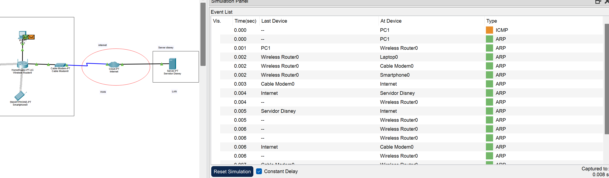
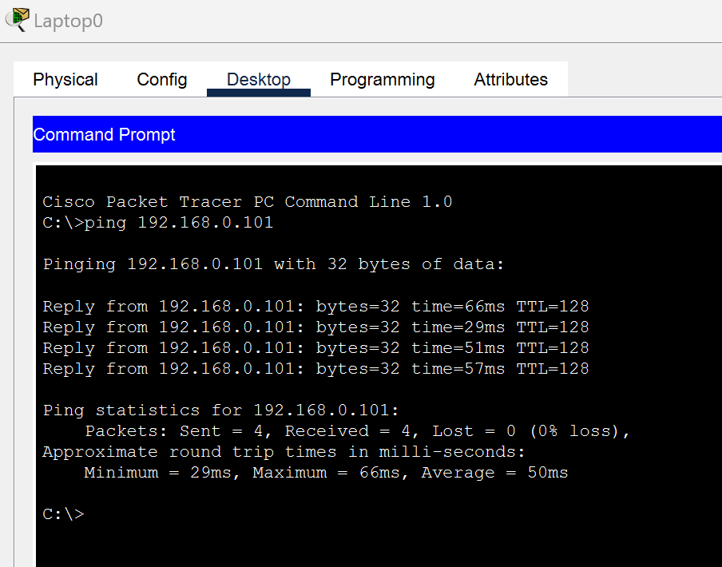

# DocumentacionLab1
## 2. Topologia de red
### Tipos de disposiivos:
- *Router (WRT300N):* Es un router inalámbrico que actúa como el núcleo de la red local (LAN). Permite la conexión de múltiples dispositivos a través de Wi-Fi y también proporciona puertos Ethernet para conexiones cableadas. Soporta hasta el estándar 802.11n para Wi-Fi, ofreciendo velocidades de hasta 300 Mbps, suficiente para el streaming de contenido de alta definición, como Disney Plus

- *Cable-Modem-PT (Cable Modem):* El módem es el dispositivo que conecta la red local al proveedor de servicios de internet (ISP). Convierte la señal analógica que viene del cable coaxial (usualmente de la compañía de cable) en una señal digital que puede ser interpretada por el router y los dispositivos conectados.

- *Cloud (Internet):*Es una red global de redes, una infraestructura física y lógica que conecta millones de computadoras, dispositivos, servidores y sistemas alrededor del mundo. Permite que las personas y las organizaciones intercambien información y accedan a servicios desde casi cualquier lugar. El Internet se compone de miles de redes más pequeñas interconectadas que utilizan protocolos de comunicación estandarizados (como TCP/IP) para transmitir datos. Esto incluye desde grandes centros de datos hasta redes locales en hogares y oficinas.

- *Server:* Es un dispositivo o software que proporciona servicios, recursos o datos a otros dispositivos, llamados "clientes", en una red. Los servidores pueden ser computadoras físicas o programas específicos que están configurados para realizar tareas específicas. 

- *Nodos terminales:* Son los dispositivos finales en una red que interactúan directamente con los usuarios. Estos dispositivos se conectan a la red para enviar y recibir datos, permitiendo a los usuarios acceder a aplicaciones, servicios y recursos en la red o en internet.

## 3. Componentes de Red
### Dispositivos
- *Router (WRT300N):* Es un router inalámbrico que conecta dispositivos dentro de la red local (LAN), tanto por cable como por Wi-Fi. Actúa como el intermediario entre los dispositivos locales (como la PC, el smartphone y la laptop) y el módem de cable, gestionando el tráfico de datos entre ellos.
  - Configuracion: El router está configurado para asignar direcciones IP automáticamente mediante DHCP (Dynamic Host Configuration Protocol).  Además, la subnet mask utilizada es 255.255.255.0. Esta máscara de subred determina qué parte de la dirección IP identifica la red y qué parte identifica los dispositivos dentro de esa red. En este caso, 255.255.255.0 indica que los primeros tres octetos (192.168.0) identifican la red, mientras que el último octeto identifica los dispositivos individuales en esa red (por ejemplo, .2, .3, etc.).

Para la conexión inalámbrica, el router está configurado en modo mixto (mixed). Esto significa que admite múltiples estándares Wi-Fi (como 802.11b/g/n) simultáneamente, permitiendo que dispositivos más antiguos y más nuevos se conecten a la red sin problemas. El nombre de la red inalámbrica, o SSID (Service Set Identifier), es HomeNetwork. Este es el nombre que los dispositivos verán cuando busquen redes Wi-Fi disponibles, y es al que deben conectarse para acceder a la red.

Y para las conexiones guiadas, tienes puertos ethernet, es decir que los dispositivos que estan conectados por cable de cobre (el Pc) usaron cables de par trenzado. Ademas de eso tambien se usa uno de esos puertos ethernet para conectar al router con el modem.

  
-*Cable-Modem-PT (Cable Modem):* Es un módem de cable que conecta la red local (a través del router inalámbrico) a internet. Este dispositivo convierte la señal de cable proporcionada por el proveedor de internet (ISP) en una señal que puede ser utilizada por los dispositivos de la red local (LAN).

-*Cloud (Internet):*Representa la conexión a internet. Es el punto al que se conecta el módem de cable para proporcionar acceso a la red mundial desde la red local. Ademas est una WAN (wide area network) y es el puente para ue dos LAN se comuniquen.

-*Server:*Es un servidor que está proporcionando el servicio de acceso al sitio Disney Plus a los dispositivos de la red local. Este servidor actúa como el punto central desde el cual se distribuye el contenido de Disney Plus a los dispositivos conectados.

-*Nodos terminales:* Los nodos terminales en esta red incluyen la PC, la laptop y el smartphone. Estos dispositivos son los que desean acceder al sitio web de Disney Plus y los que tienen contacto directo con el cliente.
## 4. Protocolos de Red

### Protocolos de Enrutamiento:
En la red implementada, se utilizó NAT (Network Address Translation) para permitir que los dispositivos en la red local (LAN) accedan a internet utilizando una única dirección IP pública. Por otro lado, DHCP (Dynamic Host Configuration Protocol) Solo se uso para el router inhalambrico, para los otros dispositivos no se utilizó, ya que se optó por asignar direcciones IP estáticas a cada dispositivo, lo cual es ideal para servidores que requieren una dirección IP fija para garantizar la correcta resolución de nombres y acceso a servicios específicos.

### Protocolos de Comunicación:
En cuanto a los protocolos de comunicación, Ethernet es el protocolo de capa 2 utilizado, proporcionando la base para la transmisión de datos dentro de la red local. Este protocolo se encarga de definir cómo los dispositivos en la red acceden y transmiten datos en el medio físico, garantizando la correcta entrega de tramas de datos entre nodos. En la capa 3, el protocolo IP (Internet Protocol) es responsable de la entrega de paquetes a través de redes distintas. Se utilizó IPv4 en este caso, gestionando la dirección de origen y destino de cada paquete enviado a través de la red.

también se utilizó Wi-Fi. Wi-Fi es un protocolo de capa 2 que permite la transmisión de datos de forma inalámbrica entre dispositivos, utilizando ondas de radio. Es esencial para permitir que los dispositivos móviles, como laptops y teléfonos celulares, se conecten a la red sin necesidad de cables físicos. Wi-Fi trabaja en conjunto con protocolos de capa 3 como IP para garantizar la conectividad a internet y la comunicación entre dispositivos en la red.

### TCP (Transmission Control Protocol):
Este protocolo de capa 4 fue utilizado para garantizar que la comunicación entre los dispositivos y el servidor de DisneyPlus sea confiable. TCP establece una conexión antes de transferir datos, asegurando que los paquetes lleguen en orden y sin pérdidas. Esto es crucial para aplicaciones web como DisneyPlus, donde la integridad de los datos es esencial para una buena experiencia de usuario.

### HTTP (HyperText Transfer Protocol):
Como protocolo de capa 7, HTTP es el protocolo utilizado para acceder a sitios web, como DisneyPlus. A través de HTTP, los navegadores web envían solicitudes al servidor de DisneyPlus, que luego responde con los datos necesarios para mostrar la página web.

### DNS (Domain Name System):
El sistema DNS se encargó de resolver el nombre de dominio "disneyplus.com" a su respectiva dirección IP. Esto fue crucial para que los dispositivos pudieran comunicarse con el servidor web de DisneyPlus de manera transparente para los usuarios.

## 5. Servicios de Red

Los servicios de red sirven para tal como dice el nombre darle servicios a una red para que funcione de manera correcta y los datos se puedan comunicar entre dispositivos de manera efectiva y precisa. Se utilizo DNS (Domain name service), servicio que permite traducir las urls que se ponen en google, como en este caso seria disney plus, cuando se pone dicho url, el DNS se encarga de traducirlo a una IP, para que asi los dispositivos puedan entender a donde se tienen que comunicar y mandar la peticion correctamente. En este caso no se utilizo DHCP, debido a que era necesario tener una IP fija para el servidor debido a que esta era la que se tenia que poner en el servidor DNS de cada dispositivo para que se pudieran comunicar correctamente con la pagina, por esto toco hacer todas las ips de los dispositivos fijas. Aunque DHCP es muy util debido a que este servicio asigna IPs automaticamente a los dispositivos conectados a una red, en este caso no nos fue de utilidad por lo descrito previamente.

### Acceso a Internet:
Los dispositivos en la red interna se conectan a Internet a través de un módem que está conectado a un router. El router utiliza NAT para gestionar la traducción de direcciones IP, permitiendo que los dispositivos internos utilicen una única IP pública para la navegación en Internet. El router también puede manejar la transmisión de datos hacia y desde Internet, asegurando que cada dispositivo reciba los paquetes correspondientes a sus solicitudes. El internet que seria la nube es la que les brinda internet al moden y al servidor, pero se tuvo que habilitar dentro de la nube la comunicacion entre el cable coaxial del moden con el cable de cobre ethernet del servidor para que pudieran intercambiar informacion.

## 8. Pruebas y Verificación

Pruebas de Conectividad: Mediante cisco packet tracer se puede acceder a la opcion de simulacion, cuando estamos dentro de esta opcion podemos mandar mensajes entre dispositivos para comprar la conectectividad entre estos y verificar si efectivamente se estan comunicando entre si.
Esto resulto muy util en el momento de verificar si el servidor se podia comunicar con los dispositivos en la casa, si esta comunicación era posible, la pagina de www.disneyplus.com podia ser abierta en los dispositivos. De igual manera si se estaba en la opcion de simulacion y se intentaba acceder a la pagina se podia ver el proceso de comunicacion entre el dispositivo y el servidor, gracias a esto se podria apreciar si el servicio fallaba cual era la razon de conectividad que hacia que no se comunicaran. 

En esta imagen, se mando un mensaje desde PC1 a Servidor disney y se puede ver el tiempo que se demora el proceso, el dispositivo del que sale, al dispositivo que llega y el tipo de protocolo en ese momento especifico, si le damos click al protocolo nos muestra la capa y mas informacion respecto a dicho protocolo. 

De igual manera se hicieron dentro de los dispositivos se accedio a desktop y ahi a command prompt con el fin de hacer ping a la ip de los diferentes dispositivos para tener otra manera de comprobar comunicacion entre ellos y verificar que todo estuviera funcionando correctamente.
En este caso se pingea a la ip del servidor, y se muestra que se consiguieron 4/4 reply por parte del servidor hacia la laptop.

